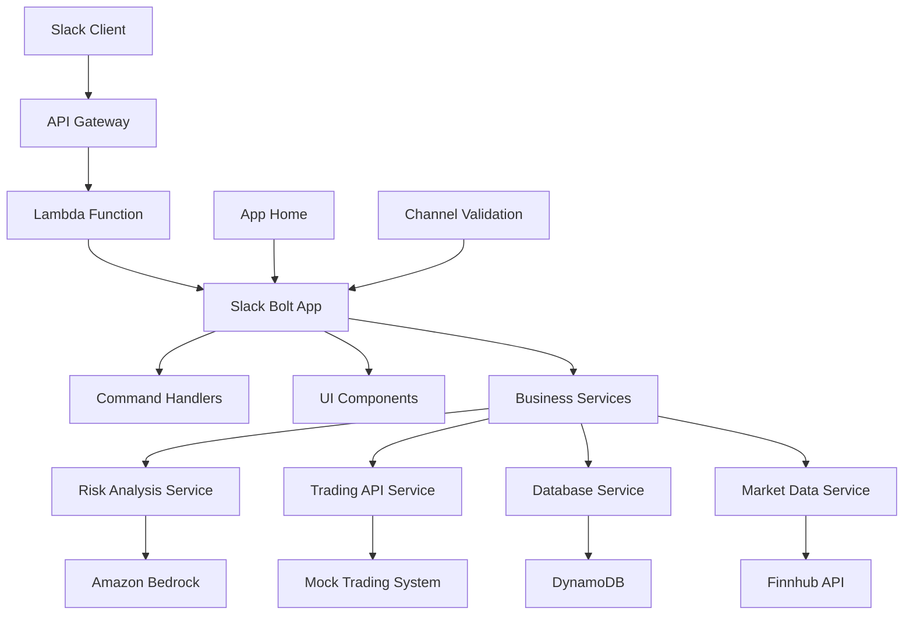

# Design Document

## Overview

The Slack Trading Bot is designed as a serverless, event-driven application built on AWS infrastructure. The system leverages Slack's Bolt framework for Python to handle user interactions, AWS Lambda for compute, DynamoDB for data persistence, and Amazon Bedrock for AI-powered risk analysis. The architecture prioritizes security, scalability, and compliance while providing a seamless user experience within Slack.

## Architecture

### High-Level Architecture



### Deployment Architecture

- **AWS Lambda**: Serverless compute for handling Slack events and commands
- **API Gateway**: HTTP endpoint for Slack webhook events
- **DynamoDB**: Three tables for trades, positions, and user sessions
- **Amazon Bedrock**: Claude model for risk analysis
- **Slack App**: Registered application with appropriate OAuth scopes

### Security Design

- **Channel Restrictions**: Whitelist-based channel validation stored in DynamoDB
- **User Authentication**: Slack OAuth with role-based access control
- **Data Encryption**: DynamoDB encryption at rest, HTTPS in transit
- **Audit Logging**: CloudWatch logs for all trading activities
- **API Security**: AWS IAM roles with least privilege access

## Components and Interfaces

### Core Application Structure

```
/jain-global-slack-bot
├── app.py                 # Main Bolt application entry point
├── listeners/
│   ├── __init__.py
│   ├── commands.py        # Slash command handlers
│   ├── actions.py         # Button and form interaction handlers
│   └── events.py          # App Home and other event handlers
├── ui/
│   ├── __init__.py
│   ├── trade_widget.py    # Trade modal Block Kit components
│   ├── dashboard.py       # App Home dashboard components
│   └── notifications.py   # Message and notification components
├── services/
│   ├── __init__.py
│   ├── database.py        # DynamoDB operations
│   ├── risk_analysis.py   # Amazon Bedrock integration
│   ├── trading_api.py     # Mock trading system integration
│   ├── market_data.py     # Finnhub API integration
│   └── auth.py           # User authentication and authorization
├── models/
│   ├── __init__.py
│   ├── trade.py          # Trade data models
│   ├── user.py           # User and role models
│   └── portfolio.py      # Portfolio and position models
├── utils/
│   ├── __init__.py
│   ├── validators.py     # Input validation utilities
│   └── formatters.py     # Data formatting utilities
├── config/
│   ├── __init__.py
│   └── settings.py       # Configuration management
├── requirements.txt
├── template.yaml         # AWS SAM template
└── .env.example
```

### Key Interfaces

#### Slack Command Interface
```python
@app.command("/trade")
def handle_trade_command(ack, body, client, logger):
    # Channel validation
    # User authorization
    # Open trade modal
```

#### Trade Modal Interface
```python
def build_trade_modal(user_id: str, channel_id: str) -> dict:
    # Returns Slack Block Kit JSON for trade input modal
```

#### Risk Analysis Interface
```python
async def analyze_trade_risk(trade_data: TradeData, portfolio: Portfolio) -> RiskAnalysis:
    # Amazon Bedrock Claude integration
    # Returns risk assessment and recommendations
```

#### Database Interface
```python
class DatabaseService:
    async def log_trade(self, trade: Trade) -> bool
    async def get_user_positions(self, user_id: str) -> List[Position]
    async def update_position(self, user_id: str, symbol: str, quantity: int) -> bool
    async def is_channel_approved(self, channel_id: str) -> bool
```

## Data Models

### Trade Model
```python
@dataclass
class Trade:
    trade_id: str
    user_id: str
    symbol: str
    quantity: int
    trade_type: str  # 'buy' or 'sell'
    price: Decimal
    timestamp: datetime
    status: str  # 'pending', 'executed', 'failed'
    risk_level: str  # 'low', 'medium', 'high'
    execution_id: Optional[str] = None
```

### Position Model
```python
@dataclass
class Position:
    user_id: str
    symbol: str
    quantity: int
    average_cost: Decimal
    current_value: Decimal
    unrealized_pnl: Decimal
    last_updated: datetime
```

### User Model
```python
@dataclass
class User:
    user_id: str
    slack_user_id: str
    role: str  # 'analyst', 'portfolio_manager', 'trader'
    permissions: List[str]
    portfolio_manager_id: Optional[str] = None
```

### Risk Analysis Model
```python
@dataclass
class RiskAnalysis:
    trade_id: str
    risk_level: str
    risk_score: float
    analysis_summary: str
    portfolio_impact: str
    recommendations: List[str]
    generated_at: datetime
```

### DynamoDB Table Schemas

#### Trades Table
- **Partition Key**: `user_id` (String)
- **Sort Key**: `trade_id` (String)
- **Attributes**: `symbol`, `quantity`, `trade_type`, `price`, `timestamp`, `status`, `risk_level`, `execution_id`
- **GSI**: `symbol-timestamp-index` for symbol-based queries

#### Positions Table
- **Partition Key**: `user_id` (String)
- **Sort Key**: `symbol` (String)
- **Attributes**: `quantity`, `average_cost`, `current_value`, `unrealized_pnl`, `last_updated`

#### Channels Table
- **Partition Key**: `channel_id` (String)
- **Attributes**: `channel_name`, `is_approved`, `created_by`, `created_at`

## Error Handling

### Error Categories and Responses

1. **Authentication Errors**
   - Invalid user or insufficient permissions
   - Response: Ephemeral error message with guidance

2. **Channel Restriction Errors**
   - Command used in unapproved channel
   - Response: Ephemeral message explaining channel restrictions

3. **Validation Errors**
   - Invalid trade parameters (negative quantity, invalid symbol)
   - Response: Modal update with field-specific error messages

4. **Market Data Errors**
   - Finnhub API unavailable or symbol not found
   - Response: Allow manual price entry with warning message

5. **Risk Analysis Errors**
   - Amazon Bedrock service unavailable
   - Response: Allow trade to proceed with warning about missing analysis

6. **Trading API Errors**
   - Mock execution system failure
   - Response: Error message with retry option and support contact

7. **Database Errors**
   - DynamoDB connection or write failures
   - Response: Error message with automatic retry and fallback logging

### Error Logging Strategy

- **CloudWatch Logs**: Structured logging with correlation IDs
- **Error Metrics**: CloudWatch metrics for monitoring and alerting
- **User Notifications**: Clear, actionable error messages in Slack
- **Audit Trail**: All errors logged with user context for compliance

## Testing Strategy

### Unit Testing
- **Framework**: pytest with async support
- **Coverage**: All service classes and utility functions
- **Mocking**: AWS services, Slack API, and external APIs
- **Test Data**: Fixtures for trade scenarios and user roles

### Integration Testing
- **Slack Integration**: Test slash commands and modal interactions
- **AWS Services**: Test DynamoDB operations and Bedrock integration
- **API Integration**: Test Finnhub market data retrieval
- **End-to-End Flows**: Complete trade workflows from command to execution

### Security Testing
- **Channel Validation**: Test unauthorized channel access attempts
- **Input Validation**: Test malicious input handling
- **Authentication**: Test role-based access controls
- **Data Protection**: Test encryption and data handling

### Performance Testing
- **Load Testing**: Concurrent user scenarios
- **Latency Testing**: Response time requirements for Slack interactions
- **Scalability Testing**: AWS Lambda cold start optimization

### Compliance Testing
- **Audit Trail**: Verify complete trade logging
- **Risk Management**: Test high-risk trade workflows
- **Data Retention**: Test data lifecycle management
- **Reporting**: Test trade history and position reporting

### Test Environment Setup
- **Local Development**: Docker containers for DynamoDB Local
- **Staging Environment**: Separate AWS account with test data
- **Mock Services**: Stubbed external APIs for reliable testing
- **Test Slack Workspace**: Dedicated workspace for integration testing

### Testing Workflow Requirements
- **Continuous Testing**: Run `npm run test` after implementing each layer/component
- **Test-Driven Development**: All tests must pass before proceeding to next implementation phase
- **No Progression Rule**: Do not move to next component until all existing tests are passing
- **Layer-by-Layer Validation**: Complete testing validation at each architectural layer

## Code Organization Standards

### File Size Guidelines
- **Minimum File Size**: Each implementation file should contain 300-400 lines of code minimum
- **Comprehensive Implementation**: Files should include complete functionality, error handling, logging, and documentation
- **Modular Design**: While maintaining substantial file sizes, ensure clear separation of concerns
- **Code Density**: Include comprehensive type hints, docstrings, error handling, and logging to reach target file sizes

### Implementation Structure Requirements
- **Substantial Components**: Each service class should be feature-complete with full error handling
- **Rich Documentation**: Extensive docstrings and inline comments to support file size requirements
- **Comprehensive Error Handling**: Detailed exception handling and logging throughout
- **Complete Interfaces**: Full implementation of all methods and properties for each component